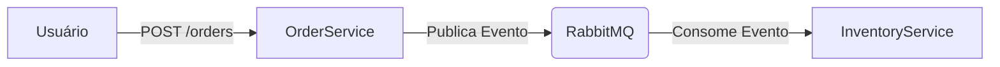

# AsyncMicroservices (C#)

Este é um projeto de demonstração de **Microserviços Assíncronos** utilizando **.NET 8**, **MassTransit** e **RabbitMQ**.

O objetivo é simular um fluxo de pedidos onde um serviço produtor (`OrderService`) envia pedidos para uma fila, e um serviço consumidor (`InventoryService`) processa esses pedidos de forma assíncrona.

## 🚀 Arquitetura

O sistema é composto por:

- **OrderService (API)**: Recebe pedidos via HTTP e publica eventos `OrderCreated`.
- **InventoryService (Worker)**: Escuta eventos `OrderCreated` e simula o processamento de estoque.
- **RabbitMQ**: Broker de mensagens responsável por rotear os eventos.



## 🛠️ Tecnologias

- **.NET 8**
- **MassTransit** (Abstração de Mensageria)
- **RabbitMQ** (Message Broker)
- **Docker Compose** (Infraestrutura)

## 📋 Pré-requisitos

- [.NET 8 SDK](https://dotnet.microsoft.com/download/dotnet/8.0)
- [Docker Desktop](https://www.docker.com/products/docker-desktop)

## 🏃 Como Rodar

### 1. Iniciar Infraestrutura

Na raiz do projeto (`AsyncMicroservices`), suba o RabbitMQ:

```bash
docker-compose up -d
```

### 2. Rodar os Serviços

Você precisará de **dois terminais** abertos.

**Terminal 1 (InventoryService - Consumidor):**
```bash
dotnet run --project InventoryService/InventoryService.csproj
```

**Terminal 2 (OrderService - Produtor):**
```bash
dotnet run --project OrderService/OrderService.csproj
```

### 3. Testar

Com os serviços rodando, envie uma requisição POST para criar um pedido.

**Via PowerShell:**
*(Verifique a porta do OrderService no log, ex: 5265)*
```powershell
Invoke-RestMethod -Method Post -Uri "http://localhost:5265/orders" -ContentType "application/json" -Body '{"customerName": "Maria Silva", "totalAmount": 199.90}'
```

**Resultado Esperado:**
- O comando retornará `Order Submitted`.
- No terminal do `InventoryService`, você verá:
  > `info: InventoryService.OrderCreatedConsumer[0]`
  > `Received OrderCreated Event: OrderId ..., Customer: Maria Silva`

## 📂 Estrutura do Projeto

- `Shared.Contracts/`: Interfaces de mensagens compartilhadas (`IOrderCreated`).
- `OrderService/`: Web API (Produtor).
- `InventoryService/`: Worker Service (Consumidor).
- `docker-compose.yml`: Configuração do RabbitMQ.
